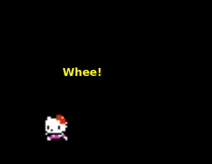

# Billo Rani 🐾

A tiny animated desktop pet for Windows (also runs on Linux/macOS with
reduced features), built with Python and PyQt5. She wanders your screen,
reacts to being dragged/dropped, gets "trapped" if you draw a selection
box over her, and has a right-click menu full of extra tricks (dance,
compliments, love notes via Notepad, Bollywood serenades, and more).



This project was recovered from a long ChatGPT conversation (`br.py` went
through many iterations) and reassembled into a clean, runnable single-file
script — see [Provenance & known limitations](#provenance--known-limitations)
below for details on that process.

## Features

- Idle / run / fly / roll / jump / bump / drop / skid animations
- Drag-and-drop physics with gravity, "hurt" blink on landing, and skid-stop
- Get her "trapped" by dragging a selection rectangle over her
- Right-click menu, organized into submenus:
  - **Fun & Movement** — Dance Party, Self-Destruct, Mirror Mode
  - **Think & Learn** — Compliment Me, Lecture Mode, Think Deeply, Search Something
  - **Love & Letters** — Write Note, Send Love Letter, Bollywood Serenade
  - **Moods & Tricks** — Annoy Her, Change Color
  - **Utilities** — Open Chrome, Reset Mood, Exit
- Mood-colored speech bubbles (happy/angry/flying/sleepy/excited)
- Sprite frames included in [`assets/`](assets) — works out of the box

## Quick start (double-click exe)

Every push to `master` builds a Windows `BilloRani.exe` automatically via
GitHub Actions. To get it:

1. Go to the repo's **Actions** tab → latest **Build Windows exe** run →
   download the `BilloRani-windows-exe` artifact (it's a zip containing
   `BilloRani.exe`).
2. Or, for tagged releases (`v1.0`, etc.), grab `BilloRani.exe` directly
   from the **Releases** page — no zip, no download from Actions needed.
3. Double-click `BilloRani.exe`. That's it — sprites are bundled inside,
   nothing else to install.

Windows may show a SmartScreen warning ("Windows protected your PC")
since the exe isn't code-signed — click **More info → Run anyway**.

## Running from source

```bash
pip install -r requirements.txt
python br.py
```

Requires Python 3.8+ and PyQt5.

Notepad-related features (Write Note, Send Love Letter, Bollywood Serenade)
and window-focusing use `notepad.exe` and Win32 APIs, so they only fully
work on **Windows**. On other platforms the script still runs — those
actions will just fail quietly (errors are caught and printed to the
console) — everything else (movement, dragging, menu, moods) works
cross-platform.

## Building the exe yourself

If you're on Windows and want to build it locally instead of using the
Actions artifact:

```bash
pip install -r requirements.txt
pip install pyinstaller
pyinstaller --onefile --windowed --name BilloRani --add-data "assets;assets" br.py
```

The exe will be in `dist/BilloRani.exe`.

## Provenance & known limitations

This repo was reconstructed from a 201-page "print to PDF" export of a
ChatGPT conversation, which contained no embedded text layer — every page
was a raster image. The code was recovered via OCR + manual review of each
page image, using the **final, most-complete iteration** of the script
(the version explicitly labeled "final: merged mood colors + trapping +
cleaned" near the end of the conversation), since the chat contains many
earlier draft rewrites of the same file.

A few notes on that process:

- **One bug fixed on purpose:** in the final version, `self.falling` was
  set by the mouse-release handler but `update_position()` never checked
  it, so gravity/falling never actually ran after being dropped (an
  earlier draft had this logic; it was dropped during a later merge).
  That block has been restored and wired back in.
- The script has been verified to **compile and run** with the real
  sprites in `assets/` and has been tested headless (no crashes over
  multiple seconds of simulated movement), but hasn't been tested on a
  real Windows desktop with a human dragging her around — please open an
  issue (or just try it and fix forward) if something doesn't match your
  original intent.
- A handful of cosmetic strings (emoji in messages, a couple of curly
  quotes) were normalized to plain ASCII during transcription.

## License

MIT — see [LICENSE](LICENSE).
